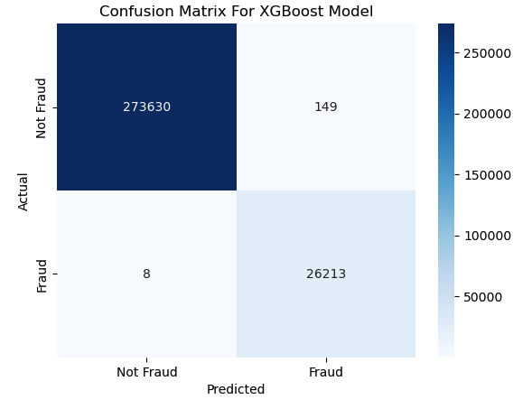
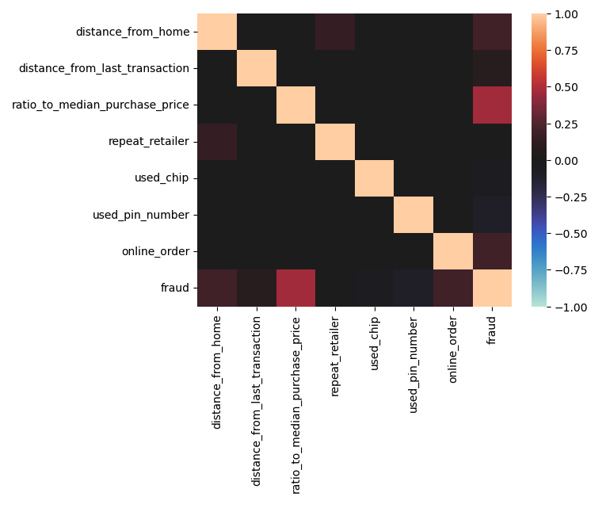
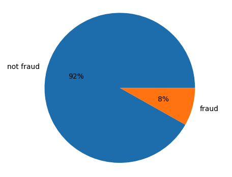
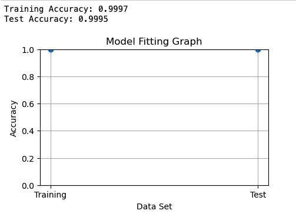
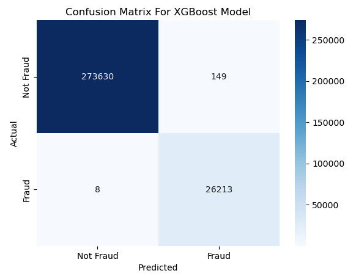

# Credit Card Fraud Detection

## Dependencies

Libraries used are likely standard.\
xgboost: https://xgboost.readthedocs.io/en/stable/install.html#conda \
imbalanced-learn (for oversampling): https://imbalanced-learn.org/stable/install.html
Dataset: https://www.kaggle.com/datasets/dhanushnarayananr/credit-card-fraud/data

## Introduction

In today's digital economy, credit card fraud poses a significant threat to consumers, financial institutions, and the global financial system. As e-commerce continues to grow exponentially, so does the sophistication and frequency of fraudulent activities. A lot of money is lost due to credit card fraud. This calls for the urgent need for robust predictive models that can effectively identify and mitigate fraudulent transactions in real time.

Being able to deploy an automatic machine to determine the validity of a transaction is beneficial for any organization that deals with online transactions. Sophisticated models such as XGBoost can discover obscure features that indicate fraud that humans have no chance of doing manually.

Effective fraud detection safeguards consumers' financial assets and helps maintain trust in digital payment systems. This is crucial for the growth of e-commerce and online banking, which are integral to modern economies.

## Figures

Performance of final XGBoost model

Correlation matrix of features

Imbalanced dataset of fraudulent transactions. We will use ADASYN oversampling for this.

## Data Exploration

There were no null values so imputation was not neccessary. The dataset is only 8.7% fraudulent transactions. We will introduce oversampling to deal with this. Some of the features such as distance from last transaction have very significant outliers, so they would probably be significant in deducing fraud. As such, I will only perform min max normalization to retain the skewed distribution of the data.

## Data Preprocessing

To deal with the extremely high values in the distance features, I use MinMax Scaler to normalize the data between 0 and 1. I also split by data with stratify option on, since I want to keep the distribution of the fraudulent and non-fradulent transactions the same in the test and train datasets. I also use stratify in cross validation later on.

## Model 1

My first model is the Random Forest Classifier, an ensemble of decision trees that can fit to a diverse range of data. I performed cross validation with 5 folds with an emphasis on recall, since I want to mitigate false negatives. The recall scores were all above 0.99. I then compared a logistic regression model to see if I would get similar metrics, but all the scores were significantly lower. Therefore, I believe there is no error in the data. I then uses RandomCV to tune the hyperparameters for the model and achieved above 0.99 recall.

## Model 2

Since a decision tree model worked well, I went forward with the XGBoost model, because of its performance and efficiency. It achieved similar metrics above 0.99, however the confusion matrix showed about 250 false negatives. I then decide to employ oversampling techniques such as SMOTE and ADASYN. ADASYN brought the most increase, bringing down the false negatives to below 10.

## Results

## Discussion

Sophisticated models like XGBoost play a crucial role in this ecosystem. Their ability to analyze large datasets quickly and identify complex patterns enables them to discover subtle indicators of fraud that humans might overlook. This capability is invaluable in maintaining the integrity of financial systems and ensuring that legitimate transactions are processed smoothly while fraudulent ones are flagged promptly.

A significant challenge in fraud detection is dealing with imbalanced datasets, where the number of legitimate transactions far exceeds fraudulent ones. In this project, we addressed this issue using oversampling techniques such as SMOTE and ADASYN. These methods helped balance the dataset, allowing the model to learn more effectively from the minority class and improve its recall rate.

The final model was able to achieve very high results, and it is accounted for overfitting.
